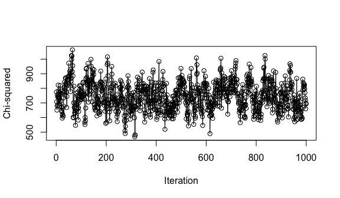
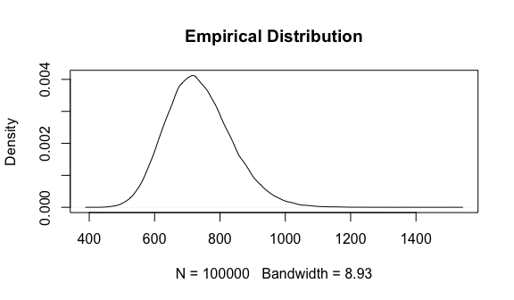
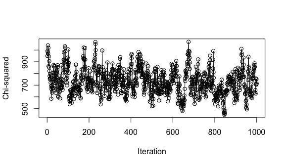

Introduction to cgsampr
================
James Scott
2018-09-16

This vignette will introduce you to the key features of the cgsampr packages.

This package provides efficient MCMC algorithms for uniform sampling of graphs conditional on vertex level data. The algorithms use state dependent kernel selection to efficiently traverse the state space. Two settings are considered:

1.  uniform sampling from unweighted graphs conditional on vertex degrees
2.  uniform sampling from weighted graphs conditional on vertex strengths.

In addition, one can fix an arbitrary set of possible edges as present or absent in all the sampled graphs.

Note that the package currently implements samplers only for directed graphs. In future versions, we hope to extend the algorithms to the undirected case.

Unweighted Graphs
-----------------

### Problem Set-Up

Let *G*<sub>0</sub> be a given directed graph with a finite vertex set *V*. Let ℱ be a subset of possible edges of a graph with vertex set *V*. Let 𝒢 be the set of all graphs *G* with the same vertex set and degree sequences as *G*<sub>0</sub>, and additionally satisfying *E*(*G*)∩ℱ = *E*(*G*<sub>0</sub>)∩ℱ. Our goal is to sample from the uniform distribution on 𝒢.

Intuitively, the set ℱ represents edges known *by design* to be present or absent. Given vertices *u* and *v*, if *u**v* belongs to ℱ then *u**v* is either present in all graphs in 𝒢, or in none. We stress *by design* because the constraints imposed by the degree sequences and ℱ may imply that further edges are present or absent in all graphs of 𝒢. We call this set $\\tilde{\\mathcal{F}}$ the set of known edges, and formally define it as
$$
\\tilde{\\mathcal{F}}=\\{\\text{possible edges }uv: uv\\in G\_0\\Leftrightarrow (uv\\in G \\text{ for all } G\\in \\mathcal{G})\\}
$$

### Example: The Chesapeake Bay Foodweb

Assuming you have installed the pacakge, begin by loading the package into the workspace. We will also use the Chesapeake data \[1\] from the cheddar package \[4\], and igraph for plotting \[6\].

``` r
library(cgsampr)
library(cheddar)
library(igraph)
#> 
#> Attaching package: 'igraph'
#> The following objects are masked from 'package:stats':
#> 
#>     decompose, spectrum
#> The following object is masked from 'package:base':
#> 
#>     union
data(ChesapeakeBay)
```

The network we consider is a food web representing the Chesapeake bay ecosystem during summer.

The package represents the network as an unweighted graph. We will instantiate an object of class 'UnweightedGraph' (this is a C++ class, which is exposed to R using the Rcpp package \[3\]). We can construct this object using the adjacency matrix *A* of the network, and an additional matrix *F* representing the links we wish to preserve in the sampled graphs.

-   *A* must be binary. *A*<sub>*i**j*</sub> = 1 implies an edge exists from vertex *i* to vertex *j*. It is not neccessary that *A* is square; if the matrix has dimension *m* × *n* with *m* ≠ *n*, it will be interpreted as the biadjacency matrix of a bipartite graph. This construction is useful for sampling binary tables conditional on row and column marginals.
-   *F* must also be a binary matrix. It *must have the same dimensions as* *A*. If *F*<sub>*i**j*</sub> = 1 and *A*<sub>*i**j*</sub> = 1, then all graphs sampled will have an edge between *i* and *j*. If *F*<sub>*i**j*</sub> = 1 and *A*<sub>*i**j*</sub> = 0, then all graphs sampled will have no edge between *i* and *j*.

Suppose we wish to sample from the uniform distribution over all graphs with the same degree sequence as the food web of the Chesapeake bay. It is unrealistic, however, to allow all species to consume themselves (i.e. to allow self-loops) in the graph. To deal with this, we will ensure *F*<sub>*i**i*</sub> = 1 for all *i*. We will also remove existing cannabilistic links from the network, so that *A*<sub>*i**i*</sub> = 0 for all *i*. We can construct the matrices *A* and *F* using the following commands.

``` r
ChesapeakeBay = RemoveCannibalisticLinks(ChesapeakeBay)
adj <- PredationMatrix(ChesapeakeBay)
f <- diag(nrow(adj))
```

`adj[i][j] = 1` if and only if species *i* has an edge to species *j* in the food web; i.e. iff specfies *j* *consumes* species *i*. `f` is diagonal, and `adj[i][i]` is zero for all *i* so that loops are forbidden in all *G* ∈ 𝒢.

To construct the object, use the following command.

``` r
g <- new(UnweightedGraph, adj, f)
```

Upon initialisation, various checks are performed on *A* and *F*. These are

-   *A* and *F* are both binary and have the same dimension.
-   *A* and *F* must not uniquely determine the graph, i.e. |𝒢|≠1

The constructor will also determine the set $\\tilde{\\mathcal{F}}$ from *A* and *F*, by identifying strongly connected components in an auxiliary graph. An example of this will be shown later.

Internally, the object is implemented in C++, allowing for fast execution of the sampling methods, and also allowing time and memory efficient internal data structures. The class is exposed to R using the Rcpp package. Various properties and methods of the class are also exposed.

#### Properties

The object *g* stores a single graph *G* ∈ 𝒢. Upon initialisation, the graph is *G*<sub>0</sub>. However, once we apply methods to the object, this graph is perturbed. The graph can be interpreted as representing the current state of the MCMC chain. To view the graph, use

``` r
g$adjacency_matrix[1:5,1:5]
#>                                          Phytoplankton
#> Phytoplankton                                        0
#> Bacteria attached to suspended particles             0
#> Sediment bacteria                                    0
#> Benthic algae                                        0
#> Free bacteria in water column                        0
#>                                          Bacteria attached to suspended particles
#> Phytoplankton                                                                   0
#> Bacteria attached to suspended particles                                        0
#> Sediment bacteria                                                               0
#> Benthic algae                                                                   0
#> Free bacteria in water column                                                   0
#>                                          Sediment bacteria Benthic algae
#> Phytoplankton                                            0             0
#> Bacteria attached to suspended particles                 0             0
#> Sediment bacteria                                        0             0
#> Benthic algae                                            0             0
#> Free bacteria in water column                            0             0
#>                                          Free bacteria in water column
#> Phytoplankton                                                        0
#> Bacteria attached to suspended particles                             0
#> Sediment bacteria                                                    0
#> Benthic algae                                                        0
#> Free bacteria in water column                                        0
```

One can also see the set $\\tilde{\\mathcal{F}}$ by using

``` r
g$fixed[1:10,1:10]
#>       [,1] [,2] [,3] [,4] [,5] [,6] [,7] [,8] [,9] [,10]
#>  [1,]    1    1    1    1    1    0    0    0    0     0
#>  [2,]    1    1    1    1    1    0    0    0    0     0
#>  [3,]    1    1    1    1    1    0    0    0    0     0
#>  [4,]    1    1    1    1    1    0    0    0    0     0
#>  [5,]    1    1    1    1    1    0    0    0    0     0
#>  [6,]    1    1    1    1    1    1    0    0    0     0
#>  [7,]    1    1    1    1    1    0    1    0    0     0
#>  [8,]    1    1    1    1    1    0    0    1    0     0
#>  [9,]    1    1    1    1    1    0    0    0    1     0
#> [10,]    1    1    1    1    1    0    0    0    0     1
```

This is represented as a matrix. $ij \\in \\tilde{\\mathcal{F}}$ if and only if `g$fixed[i,j] = 1`. To reiterate, the matrix returned by `g$adjacency_matrix` will change when we sample, whilst the matrix returned by `g$fixed` will always be the same.

#### Methods

The main method is `g$sample`. This takes three arguments:

1.  The number of samples we wish to obtain.
2.  The level of thinning to use.
3.  The number of iterations to perform before returning samples (i.e. the burn-in).

For example, if thinning is set to 50, the Markov chain will run 50 iterations between any two samples returned. Here is an example.

``` r
nsamples <- 1e5
thin <- 5
burnin <- 1e3
res <- g$sample(nsamples, thin, burnin)
```

`g$sample` returns a list of adjacency matrices.

``` r
typeof(res)
#> [1] "list"
length(res)
#> [1] 100000

# each item in the list is an adjacency matrix of the same size as the original matrix.
dim(res[[1e3]])
#> [1] 33 33

# visualise correspoing graph
net <- graph_from_adjacency_matrix(res[[1e3]])
plot(net, vertex.label=NA, layout = layout.mds(net))
```


Let's check the fixed components have been respected.

``` r
diag_sum_zero <- function(a) sum(diag(a)) == 0
all(sapply(res, diag_sum_zero))
#> [1] TRUE
```

and that the degree sequences have been respected

``` r
correct_degrees <- function(a, a0) all(rowSums(adj) == rowSums(a0)) && all(colSums(adj) == colSums(a0))
all(sapply(res, correct_degrees, adj))
#> [1] TRUE
```

The list structure allows us to efficiently apply arbitraty statistics using `sapply`. Consider the following simple statistic, which measures the proportion of links which are between the first 10 species

``` r
rownames(adj)[1:10]
#>  [1] "Phytoplankton"                           
#>  [2] "Bacteria attached to suspended particles"
#>  [3] "Sediment bacteria"                       
#>  [4] "Benthic algae"                           
#>  [5] "Free bacteria in water column"           
#>  [6] "Heterotrophic microflagellates"          
#>  [7] "Microzooplankton"                        
#>  [8] "Zooplankton"                             
#>  [9] "Ctenophores"                             
#> [10] "Chrysaora quinquecirrha"
```

Here we define the statistic, and apply it across all sampled graphs.

``` r
first_ten <- function(a) sum(a[1:10,1:10])/sum(a)
samples <- sapply(res, first_ten)
```

We can easily check how well the MCMC chain has mixed, and the empirical distribution.

``` r
# check mixing and empirical distribution
plot(samples[1:1e3], type = 'o', ylab = 'Statistic', xlab = 'Iteration')
```


``` r
plot(hist(samples, breaks = 100), main = "Histogram")
```


### Identifying $\\tilde{\\mathcal{F}}$

As mentioned, given an adjacency matrix *A* and the matrix *F*, the constructor will automatically determine all fixed edges/non-edges $\\tilde{\\mathcal{F}}$, and represent them in a matrix. Here, we present a simple example of this functionality.

Consider the adjacency matrix

``` r
a <- diag(4)
a[3:4,1:2] <- 1 
a
#>      [,1] [,2] [,3] [,4]
#> [1,]    1    0    0    0
#> [2,]    0    1    0    0
#> [3,]    1    1    1    0
#> [4,]    1    1    0    1
```

Keeping the degree sequences fixed implies that the entries `a[3:4,1:2]` and `a[1:2,3:4]` are determined. Even if we naively specify *F*, the constructor will identify these determined elements:

``` r
# naive F
f <- matrix(0, 4,4)
g <- new(UnweightedGraph, a, f)
g$fixed
#>      [,1] [,2] [,3] [,4]
#> [1,]    0    0    1    1
#> [2,]    0    0    1    1
#> [3,]    1    1    0    0
#> [4,]    1    1    0    0
```

Weighted Graphs
---------------

### Problem Set-up

Suppose we observe an integer-weighted directed or undirected graph *G*<sub>0</sub>. Our aim is to sample uniformly from the set of graphs respecting *G*<sub>0</sub>'s vertex strengths and an arbitrary set of known edges/non-edges ℱ. As before, we denote the reference set of graphs from which we sample by 𝒢.

### Example

For illustration, the package includes an example dataset called `occupations`. This is a mobility table recording the occupations of 775 fathers and their sons. There are 14 separate job classifications. The data originates from \[5\].

``` r
data("occupations")
t0 <- occupations
t0
#>       V1 V2 V3 V4 V5 V6 V7 V8 V9 V10 V11 V12 V13 V14
#>  [1,] 28  0  4  0  0  0  1  3  3   0   3   1   5   2
#>  [2,]  2 51  1  1  2  0  0  1  2   0   0   0   1   1
#>  [3,]  6  5  7  0  9  1  3  6  4   2   1   1   2   7
#>  [4,]  0 12  0  6  5  0  0  1  7   1   2   0   0  10
#>  [5,]  5  5  2  1 54  0  0  6  9   4  12   3   1  13
#>  [6,]  0  2  3  0  3  0  0  1  4   1   4   2   1   5
#>  [7,] 17  1  4  0 14  0  6 11  4   1   3   3  17   7
#>  [8,]  3  5  6  0  6  0  2 18 13   1   1   1   8   5
#>  [9,]  0  1  1  0  4  0  0  1  4   0   2   1   1   4
#> [10,] 12 16  4  1 15  0  0  5 13  11   6   1   7  15
#> [11,]  0  4  2  0  1  0  0  0  3   0  20   0   5   6
#> [12,]  1  3  1  0  0  0  1  0  1   1   1   6   2   1
#> [13,]  5  0  2  0  3  0  1  8  1   2   2   3  23   1
#> [14,]  5  3  0  2  6  0  1  3  1   0   0   1   1   9
```

We may wish to evaluate particular hypotheses concerning this table. Examples include:

-   *Independence: * Are the occupational choices of a son independent of the occupational status of their father?
-   *Quasi-independence:* Conditional on sons not pursuing the same occupation as their father, are their occupational choices independent of their father's status?

cgsampr allows testing such hypotheses by comparing a statistic computed on the observed table *t*<sub>0</sub> to the empirical distribution obtained by uniform sampling from the set of all tables with the same marginals (and perhaps additionally some fixed entries).

We consider testing the independence hypothesis. We will use the chi-squared statistic, defined as

$$
\\chi^2 = \\sum\_{i=1}^r \\sum\_{j=1}^{c} \\frac{(t\_{ij} - \\hat{m}\_{ij})^2}{\\hat{m}\_{ij}}
$$

where *t* is an observed table, and $\\hat{m}$ is a matrix representing the MLEs of expected cell counts under the log-linear model for independence. For independence $\\hat{m}\_{ij} = n\_{i+}n\_{+j}/n$, where *n*<sub>*i*+</sub> is the *i*th row sum of *t*<sub>0</sub>, *n*<sub>+*j*</sub> is the *j*th column sum of *t*<sub>0</sub>, and *n* is the total number of observations tabulated. We compute the MLEs for our example

``` r
# construct MLEs for cell counts for the independence Model
m <- (rowSums(t0) %*% t(colSums(t0)))/sum(t0)
round(m,1)
#>         V1   V2  V3  V4   V5  V6  V7  V8   V9 V10 V11 V12  V13  V14
#>  [1,]  5.4  7.0 2.4 0.7  7.9 0.1 1.0 4.1  4.5 1.5 3.7 1.5  4.8  5.5
#>  [2,]  6.7  8.6 3.0 0.9  9.8 0.1 1.2 5.1  5.5 1.9 4.6 1.8  5.9  6.9
#>  [3,]  5.9  7.5 2.6 0.8  8.5 0.1 1.0 4.5  4.8 1.7 4.0 1.6  5.2  6.0
#>  [4,]  4.8  6.1 2.1 0.6  6.9 0.1 0.9 3.6  3.9 1.4 3.2 1.3  4.2  4.9
#>  [5,] 12.5 16.0 5.5 1.6 18.1 0.1 2.2 9.5 10.2 3.6 8.5 3.4 11.0 12.8
#>  [6,]  2.8  3.6 1.2 0.4  4.1 0.0 0.5 2.1  2.3 0.8 1.9 0.8  2.5  2.9
#>  [7,]  9.5 12.3 4.2 1.2 13.9 0.1 1.7 7.3  7.8 2.7 6.5 2.6  8.4  9.8
#>  [8,]  7.5  9.6 3.3 1.0 10.9 0.1 1.3 5.7  6.1 2.1 5.1 2.0  6.6  7.7
#>  [9,]  2.1  2.6 0.9 0.3  3.0 0.0 0.4 1.6  1.7 0.6 1.4 0.6  1.8  2.1
#> [10,] 11.5 14.8 5.1 1.5 16.7 0.1 2.1 8.8  9.4 3.3 7.8 3.1 10.1 11.8
#> [11,]  4.4  5.7 2.0 0.6  6.5 0.1 0.8 3.4  3.7 1.3 3.0 1.2  3.9  4.5
#> [12,]  2.0  2.5 0.9 0.3  2.8 0.0 0.3 1.5  1.6 0.6 1.3 0.5  1.7  2.0
#> [13,]  5.5  7.1 2.4 0.7  8.0 0.1 1.0 4.2  4.5 1.6 3.8 1.5  4.9  5.7
#> [14,]  3.5  4.5 1.5 0.5  5.0 0.0 0.6 2.6  2.8 1.0 2.4 0.9  3.1  3.6
```

giving an observed chi-squared statistic of *χ*<sub>0</sub><sup>2</sup> = 1005.45.

``` r
# Pearson's chi squared statistic
X <- function(t, m){
  y <- (t-m)^2/m
  sum(y*is.finite(y), na.rm = T)
}
X0 <- X(t0,m)
X0
#> [1] 1005.454
```

This seems high; as one might expect.

We can represent *t*<sub>0</sub> as a bipartite weighted graph. cgsampr represents weighted graphs in an object `WeightedSGGraph`. We instantiate an object in the same way as we did for unweighted graphs.

``` r
f <- matrix(0, nrow(t0), ncol(t0))
wg <- new(WeightedSGGraph, t0, f)
```

We will run an MCMC chain to approximate the uniform distribution on 𝒢.

``` r
res <- wg$sample(1e5, 100, 1e5)
samples <- sapply(res, X, m)
```

Check mixing and plot the empirical distribution.

``` r
plot(samples[1:1e3], type = 'o', ylab = 'Chi-squared', xlab = 'Iteration')
```



``` r
plot(density(samples), main  = "Empirical Distribution")
```



And compute a p-value

``` r
mean(samples >= X0)
#> [1] 0.00772
```

Based on the p-value, we may reject the hypothesis of indepdendence at a significance of *α* = 0.01.

cgsampr also provides an implementation of the Diaconis and Sturmfels algorithm \[2\], which should yield equivalent results (if run long enough). This is implemented in an object `WeightedDGGraph`.

``` r
wg_ds <- new(WeightedDGGraph, t0, f)
res_ds <- wg_ds$sample(1e5, 100, 1e5)
samples_ds <- sapply(res_ds, X, m)
plot(samples_ds[1:1e3], type = 'o', ylab = 'Chi-squared', xlab = 'Iteration')
```



``` r
plot(density(samples_ds), main  = "Empirical Distribution")
```


and again, we can compute a p-value.

``` r
mean(samples_ds >= X0)
#> [1] 0.00778
```

In this simple example, the Diaconis and Sturmfels algorithm is efficient. However, if the table were sparse, the chain would mix very slowly. Additionally, if the table is incomplete (i.e. some elements are fixed), the resulting Markov chain is not gauranteed to be irreducible.

References
==========

\[1\] D. Baird and R. E. Ulanowicz. “The Seasonal Dynamics of The Chesapeake Bay Ecosystem”. In: *Ecological Monographs* 59.4 (Feb. 1989), pp. 329-364. DOI: 10.2307/1943071. &lt;URL: <https://doi.org/10.2307/1943071>&gt;.

\[2\] P. Diaconis and B. Sturmfels. “Algebraic algorithms for sampling from conditional distributions”. In: *The Annals of Statistics* 26.1 (Feb. 1998), pp. 363-397. DOI: 10.1214/aos/1030563990. &lt;URL: <https://doi.org/10.1214/aos/1030563990>&gt;.

\[3\] D. Eddelbuettel and R. François. “Rcpp: Seamless R and C++ Integration”. In: *Journal of Statistical Software* 40.8 (2011). DOI: 10.18637/jss.v040.i08. &lt;URL: <https://doi.org/10.18637/jss.v040.i08>&gt;.

\[4\] L. N. Hudson, R. Emerson, G. B. Jenkins, et al. “Cheddar: analysis and visualisation of ecological communities in R”. In: *Methods in Ecology and Evolution* 4.1 (Nov. 2012). Ed. by M. Spencer, pp. 99-104. DOI: 10.1111/2041-210x.12005. &lt;URL: <https://doi.org/10.1111/2041-210x.12005>&gt;.

\[5\] K. Pearson "On the theory of contingency and its relation to association and normal correlation". Publisher: Dulau and Co. (1904), &lt;URL: <https://archive.org/details/cu31924003064833>&gt;.

\[6\] G. Csardi, and T. Nepusz. "The igraph software package for complex network research". In: InterJournal, Complex Systems, (2006), 1695(5), pp.1-9.
